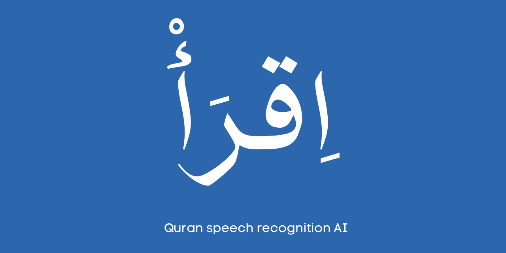

# Iqra AI



World-class Quran speech recognition with Tarteel-style mistake detection, Iqra/memorization mode, and multilingual translations.

**Languages:** Arabic · English · Somali · Amharic · Swahili

**Author:** [Abdirahman Ahmed](https://abdirahman.net) · Offered as sadaqa jariyah

## Contents

- [Features](#features)
- [Build with Iqra AI](#build-with-iqra-ai)
- [Quick Start](#quick-start)
- [Project Structure](#project-structure)
- [Tabs](#tabs)
- [Languages](#languages)
- [Data Sources](#data-sources)
- [Requirements](#requirements)
- [Contributing](#contributing)
- [Images](#images)
- [Acknowledgements](#acknowledgements)
- [License](#license)

---

## Features

- **ASR** — Tarteel whisper-base-ar-quran (fine-tuned for Quranic Arabic)
- **Verse matching & mistake detection** — Green (correct), red (missed/incorrect), yellow (extra)
- **Iqra mode** — Pick Surah:Ayah, recite, compare with canonical text and see mistakes
- **Translations** — Arabic, English, Somali, Amharic, Swahili via [Quran Enc](https://quranenc.com)
- **Letter practice** — Hijaiyah letter classification
- **Batch transcription** — Process multiple files, export as TXT/JSON/ZIP
- **Export** — TXT, JSON, SRT via CLI

---

## Build with Iqra AI

After cloning, use the modules to build your own apps:

| Build | Use |
|-------|-----|
| **Quran memorization app** | Import `asr_engine`, `matcher`, `quran_data` → transcribe recitation, match verses, show mistakes. |
| **Mobile / web app backend** | Run `app.py` or wrap `transcribe()` + `match_and_analyze()` in your API. |
| **Letter learning app** | Use hijaiyah classifier from `app.py` for kids/learners. |
| **Batch tools** | `transcribe.py --batch` or call `asr_transcribe()` in a loop, export JSON/TXT. |

---

## Quick Start

> [!TIP]
> On first run, Arabic XML and ASR models download automatically. Translations require internet.

### 1. Clone and enter the repo

```bash
git clone https://github.com/AbdirahmanNomad/IqraAI.git
cd IqraAI
```

### 2. Set up Python environment

```bash
python3 -m venv venv
source venv/bin/activate      # Mac/Linux
# OR on Windows:  venv\Scripts\activate

pip install -r requirements.txt
```

### 3. Run the web app

```bash
python app.py
```

Open **http://127.0.0.1:7860** in your browser.

### 4. CLI (optional)

```bash
python transcribe.py path/to/audio.wav
python transcribe.py audio.wav --match --export json
```

> [!NOTE]
> First run downloads ~500MB of models — expect a short wait.

---

## Project Structure

```
├── app.py              # Gradio web app (entry point)
├── transcribe.py       # CLI for transcription & batch export
├── config.py           # Models, URLs, translation keys
├── asr_engine.py       # Whisper pipeline, audio preprocessing
├── matcher.py          # Verse matching, mistake detection
├── quran_data.py       # Tanzil Arabic XML + Quran Enc API
├── data/               # Arabic Quran XML (auto-downloaded)
├── requirements.txt
├── README.md
└── LICENSE
```

---

## Tabs

| Tab             | Description                                                                 |
|-----------------|-----------------------------------------------------------------------------|
| **Transcribe**  | Record or upload, get transcription + verse match                          |
| **Iqra Mode**   | Select Surah:Ayah, see canonical verse (RTL), record recitation, compare   |
| **Letter Practice** | Say one hijaiyah letter, get top-3 predictions                         |
| **Batch**       | Upload multiple audio files, transcribe all, export as table + JSON + ZIP   |

---

## Languages

| Language | Code | Source |
|----------|------|--------|
| Arabic   | `ar` | Tanzil |
| English  | `en` | Quran Enc (Rwwad) |
| Somali   | `somali` | Quran Enc |
| Amharic  | `amharic` | Quran Enc |
| Swahili  | `swahili` | Quran Enc |

More languages will be added in the future.

---

## Data Sources

| Source      | Data                                                                 |
|------------|----------------------------------------------------------------------|
| **Tanzil** | [ceefour/qurandatabase](https://github.com/ceefour/qurandatabase) — Arabic Quran (text from [Tanzil.info](https://tanzil.info), CC-BY-ND-3.0) |
| **Quran Enc** | [Quran Enc API](https://quranenc.com) — English (Rwwad), Somali, Amharic, Swahili |

---

## Requirements

- Python 3.10+
- Mac M3: Metal (MPS) acceleration supported; falls back to CPU

> [!NOTE]
> First run: Arabic XML and ASR models download automatically. Translations require internet (Quran Enc API).

---

## Contributing

Contributions are welcome. See [CONTRIBUTING.md](CONTRIBUTING.md) for guidelines.

## Images

For logos or screenshots in this repo: use PNG or JPG. **Logo/banner:** 1280×640 or 1200×630 px. **Inline images:** max 800px width, under 1MB. GitHub supports up to 10MB per file.

---

## Acknowledgements

Thank you to the projects and APIs that make Iqra AI possible:

- **[Tanzil](https://tanzil.info)** & **[ceefour/qurandatabase](https://github.com/ceefour/qurandatabase)** — Arabic Quran text
- **[Quran Enc](https://quranenc.com)** — Translations (English, Somali, Amharic, Swahili)
- **[Tarteel](https://tarteel.ai)** — Quran ASR model ([whisper-base-ar-quran](https://huggingface.co/tarteel-ai/whisper-base-ar-quran))
- **[ojisetyawan](https://huggingface.co/ojisetyawan)** — Hijaiyah letter classification model
- **[Hugging Face](https://huggingface.co)** — Transformers & model hosting
- **[Gradio](https://gradio.app)** — Web UI framework

---

## License

Open source. See [LICENSE](LICENSE) for details.

---

**Abdirahman Ahmed** · [abdirahman.net](https://abdirahman.net)
